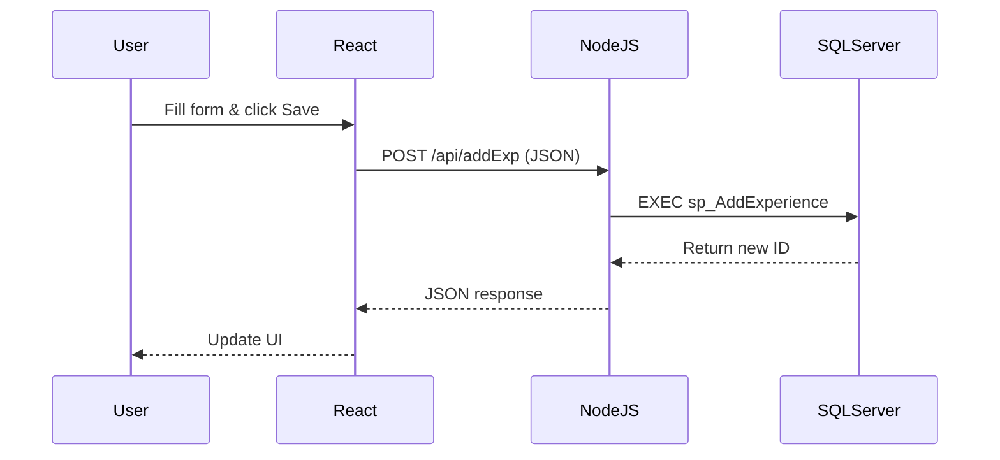

# Rozgar Pakistan - E-Resume Builder
## ReactJS Integration, Node.js & CRUD Operations
---

<p align="center">
  
  
  
</p>

---

## Table of Contents

1. [Introduction](#1-introduction)
2. [Learning Objectives](#2-learning-objectives)
3. [Prerequisites](#3-prerequisites)
4. [Architecture](#4-understanding-the-architecture)
5. [Project Structure](#5-project-structure)
6. [Quick Start](#6-quick-start)
7. [Database Setup](#7-database-setup-sql-server)
8. [Backend Development](#8-backend-development-nodejs)
9. [Frontend Development](#9-frontend-development-react)
10. [Task Solutions](#10-task-by-task-solutions)
11. [API Reference](#11-api-reference)
12. [Troubleshooting](#12-troubleshooting-guide)
13. [Best Practices](#13-best-practices)
14. [Resources](#14-further-learning-resources)

---

## 1. Introduction

Welcome to **Lab 08**! In this lab, you will build a full-stack web application called **"Rozgar Pakistan"** - an E-Resume Builder portal. This project teaches you how modern web applications work by connecting three layers:

| Layer | Technology | Purpose |
|-------|------------|---------|
| **Frontend** | React | User Interface & Interactions |
| **Backend** | Node.js/Express | API & Business Logic |
| **Database** | SQL Server | Data Storage |

By the end of this lab, you will understand how these layers communicate and how to perform **CRUD** (Create, Read, Update, Delete) operations across them.

---

## 2. Learning Objectives

After completing this lab, you will be able to:

- [x] Create SQL Server stored procedures for data operations
- [x] Build a Node.js/Express backend server
- [x] Connect Node.js to SQL Server using the `mssql` package
- [x] Create REST API endpoints (GET, POST, PUT, DELETE)
- [x] Build React functional components
- [x] Use React Hooks (`useState`, `useEffect`)
- [x] Pass data between components using props
- [x] Use `fetch()` API for HTTP requests
- [x] Understand full-stack application architecture

---

## 3. Prerequisites

### Required Software

| Software | Version | Download Link |
|----------|---------|---------------|
| SQL Server | 2019+ | [Download](https://www.microsoft.com/en-us/sql-server/sql-server-downloads) |
| SQL Server Management Studio | Latest | [Download](https://docs.microsoft.com/en-us/sql/ssms/download-sql-server-management-studio-ssms) |
| Node.js | 18+ | [Download](https://nodejs.org/) |
| VS Code (Recommended) | Latest | [Download](https://code.visualstudio.com/) |

### Verify Installation

```bash
# Check Node.js
node --version
# Expected: v18.x.x or higher

# Check npm
npm --version
# Expected: 9.x.x or higher
```

### Required Knowledge

- Basic SQL (SELECT, INSERT, UPDATE, DELETE)
- Basic JavaScript (variables, functions, objects, arrays)
- Basic HTML/CSS understanding

---

## 4. Understanding the Architecture

Modern web applications follow a **THREE-TIER** architecture:

```
┌──────────────────┐         ┌──────────────────┐         ┌──────────────────┐
│                  │  HTTP   │                  │  SQL    │                  │
│  REACT FRONTEND  │ ──────► │  NODE.JS BACKEND │ ──────► │   SQL SERVER     │
│  (localhost:3000)│  JSON   │  (localhost:5000)│  Query  │   (RozgarDB)     │
│                  │ ◄────── │                  │ ◄────── │                  │
└──────────────────┘         └──────────────────┘         └──────────────────┘
        │                           │                            │
        ▼                           ▼                            ▼
  • User Interface           • Business Logic            • Data Storage
  • User Interactions        • API Endpoints             • Tables
  • State Management         • Database Connection       • Stored Procedures
  • HTTP Requests            • Data Validation           • Data Integrity
```

### Data Flow Example (Adding New Experience)



### Why This Architecture?

| Benefit | Description |
|---------|-------------|
| **Security** | Frontend never talks directly to database |
| **Scalability** | Each layer can be scaled independently |
| **Maintainability** | Changes in one layer don't affect others |
| **Reusability** | Same backend can serve mobile apps, other websites |

---

## 5. Project Structure

```
Project_Files/
│
├── 📁 SQL Files (Database Layer)
│   ├── 01_Setup_Database.sql         # Creates database and tables
│   ├── 02_Task1_sp_LoginUser.sql     # Login stored procedure
│   └── 03_Task2_CRUD_Procedures.sql  # CRUD stored procedures
│
├── 📁 Task Solutions (Reference Files)
│   ├── 04_Task3_Login.jsx            # React Login component
│   ├── 05_Task4_ExperienceTable.jsx  # React Table component
│   ├── 06_Task5_dbConfig.js          # Database configuration
│   ├── 07_Task6_Backend_POST_API.js  # Express POST endpoint
│   ├── 08_Task7_useEffect_READ.jsx   # React useEffect example
│   └── 09_Task8_handleSave_CREATE.jsx # React form submission
│
├── 📁 backend/                        # NODE.JS BACKEND
│   ├── server.js                      # Main server file
│   └── package.json                   # Dependencies
│
├── 📁 frontend/                       # REACT FRONTEND
│   ├── public/
│   │   └── index.html
│   ├── src/
│   │   ├── App.js                     # Main application
│   │   ├── App.css                    # Styles
│   │   ├── index.js                   # Entry point
│   │   └── components/
│   │       ├── Login.jsx
│   │       ├── ExperienceTable.jsx
│   │       └── AddExperience.jsx
│   └── package.json
│
├── .gitignore
├── README.md                          # This file
└── QUICK_START.md                     # Fast setup guide
```

---

## 6. Quick Start

> ⏱️ **Get running in 5 minutes!** For detailed explanations, see sections below.

### Step 1: Database Setup (2 min)

1. Open **SQL Server Management Studio**
2. Connect to your local server
3. Execute these files in order:
   ```
   01_Setup_Database.sql
   02_Task1_sp_LoginUser.sql
   03_Task2_CRUD_Procedures.sql
   ```

### Step 2: Start Backend (1 min)

```bash
cd backend
npm install
```

**Configure database connection** (edit `server.js` if needed):

- **Windows Authentication (SQL Express):** No changes needed if using default config
- **SQL Server Authentication:** Update the `user` and `password` in dbConfig

```bash
npm start
```

> ✅ Expected: `Connected to SQL Server successfully!`

### Step 3: Start Frontend (1 min)

```bash
# Open NEW terminal
cd frontend
npm install
npm start
```

> ✅ Browser opens at `http://localhost:3000`

### Step 4: Login

```
Email: ali.raza@email.com
Password: password123
```

---

## 7. Database Setup (SQL Server)

### Execute Scripts in Order

| Order | File | Purpose |
|-------|------|---------|
| 1️⃣ | `01_Setup_Database.sql` | Creates RozgarDB, tables, sample data |
| 2️⃣ | `02_Task1_sp_LoginUser.sql` | Login stored procedure |
| 3️⃣ | `03_Task2_CRUD_Procedures.sql` | CRUD stored procedures |

### Understanding the Schema

```sql
-- Users Table
CREATE TABLE Users (
    UserID INT PRIMARY KEY IDENTITY(1,1),
    Email VARCHAR(100) UNIQUE NOT NULL,
    PasswordHash VARCHAR(100) NOT NULL,
    FullName VARCHAR(100) NOT NULL,
    CreatedAt DATETIME DEFAULT GETDATE()
);

-- Experience Table
CREATE TABLE Experience (
    ExpID INT PRIMARY KEY IDENTITY(100,1),
    UserID INT FOREIGN KEY REFERENCES Users(UserID),
    JobTitle VARCHAR(100) NOT NULL,
    CompanyName VARCHAR(100) NOT NULL,
    YearsWorked INT NOT NULL,
    IsCurrentJob BIT DEFAULT 0
);
```

### Verify Setup

```sql
USE RozgarDB;
SELECT * FROM Users;      -- Should show 2 users
SELECT * FROM Experience; -- Should show 5 records
```

---

## 8. Backend Development (Node.js)

### Key Concepts

#### 1. Package Imports

```javascript
const express = require('express');  // Web framework
const sql = require('mssql');        // SQL Server connector
const cors = require('cors');        // Cross-Origin requests
```

#### 2. Database Configuration (Task 5)

You have two options depending on your SQL Server authentication mode:

**Option A: Windows Authentication (Recommended for local development)**

```javascript
// Using Windows Authentication with SQL Express
const sql = require('mssql/msnodesqlv8');  // Note: different import

const dbConfig = {
    connectionString: 'Driver={ODBC Driver 17 for SQL Server};Server=localhost\\SQLEXPRESS;Database=RozgarDB;Trusted_Connection=yes;'
};
```

> Requires additional package: `npm install msnodesqlv8`

**Option B: SQL Server Authentication**

```javascript
const sql = require('mssql');

const dbConfig = {
    user: 'sa',                     // Your SQL username
    password: 'YourPassword',       // Your SQL password
    server: 'localhost',            // Or 'localhost\\SQLEXPRESS'
    database: 'RozgarDB',
    options: {
        encrypt: true,
        trustServerCertificate: true
    }
};
```

#### 3. API Endpoint Structure (Task 6)

```javascript
app.post('/api/addExp', async (req, res) => {
    try {
        const { UserID, JobTitle, CompanyName, YearsWorked } = req.body;
        
        let pool = await sql.connect(dbConfig);
        let result = await pool.request()
            .input('UserID', sql.Int, UserID)
            .input('JobTitle', sql.VarChar(100), JobTitle)
            .input('CompanyName', sql.VarChar(100), CompanyName)
            .input('YearsWorked', sql.Int, YearsWorked)
            .execute('sp_AddExperience');
        
        res.json({ success: true, data: result.recordset[0] });
    } catch (err) {
        res.status(500).json({ success: false, error: err.message });
    }
});
```

### Running the Backend

```bash
cd backend
npm install          # Install dependencies
npm start            # Start server on port 5000
```

---

## 9. Frontend Development (React)

### Key React Concepts

#### 1. useState Hook (Task 3)

```jsx
const [email, setEmail] = useState('');
// email = current value
// setEmail = function to update
// '' = initial value
```

#### 2. useEffect Hook (Task 7)

```jsx
useEffect(() => {
    fetch('http://localhost:5000/api/getExp/1')
        .then(res => res.json())
        .then(data => console.log(data));
}, []); // Empty array = run once on mount
```

#### 3. Props (Task 4)

```jsx
// Parent component
<ExperienceTable data={experienceArray} />

// Child component
function ExperienceTable({ data }) {
    return data.map(job => (
        <tr key={job.ExpID}>
            <td>{job.JobTitle}</td>
        </tr>
    ));
}
```

#### 4. Form Submission (Task 8)

```jsx
const handleSave = async () => {
    await fetch('http://localhost:5000/api/addExp', {
        method: 'POST',
        headers: { 'Content-Type': 'application/json' },
        body: JSON.stringify({
            UserID: 1,
            JobTitle: 'Software Engineer',
            CompanyName: 'Systems Ltd',
            YearsWorked: 2
        })
    });
};
```

### Running the Frontend

```bash
cd frontend
npm install          # Install dependencies
npm start            # Start on port 3000
```

---

## 10. Task-by-Task Solutions

### Task 1: Secure Login Procedure (SQL)

📁 **File:** `02_Task1_sp_LoginUser.sql`

```sql
CREATE PROCEDURE sp_LoginUser
    @Email VARCHAR(100),
    @Password VARCHAR(100)
AS
BEGIN
    SELECT UserID, FullName
    FROM Users
    WHERE Email = @Email AND PasswordHash = @Password;
END;
```

---

### Task 2: CRUD Procedures (SQL)

📁 **File:** `03_Task2_CRUD_Procedures.sql`

```sql
-- READ
CREATE PROCEDURE sp_GetExperience @UserID INT
AS
BEGIN
    SELECT ExpID, JobTitle, CompanyName, YearsWorked, IsCurrentJob
    FROM Experience WHERE UserID = @UserID;
END;

-- CREATE
CREATE PROCEDURE sp_AddExperience
    @UserID INT, @JobTitle VARCHAR(100), 
    @CompanyName VARCHAR(100), @YearsWorked INT
AS
BEGIN
    INSERT INTO Experience (UserID, JobTitle, CompanyName, YearsWorked)
    VALUES (@UserID, @JobTitle, @CompanyName, @YearsWorked);
END;
```

---

### Task 3: React Login Component

📁 **File:** `04_Task3_Login.jsx`

```jsx
import React, { useState } from 'react';

function Login() {
    const [email, setEmail] = useState('');
    const [password, setPassword] = useState('');

    return (
        <div>
            <input 
                type="email" 
                value={email} 
                onChange={(e) => setEmail(e.target.value)} 
            />
            <input 
                type="password" 
                value={password} 
                onChange={(e) => setPassword(e.target.value)} 
            />
            <button onClick={() => console.log(email, password)}>
                Login
            </button>
        </div>
    );
}
```

---

### Task 4: React Experience Table

📁 **File:** `05_Task4_ExperienceTable.jsx`

```jsx
function ExperienceTable({ data }) {
    return (
        <table>
            <thead>
                <tr><th>Job Title</th><th>Company</th></tr>
            </thead>
            <tbody>
                {data.map((job) => (
                    <tr key={job.ExpID}>
                        <td>{job.JobTitle}</td>
                        <td>{job.CompanyName}</td>
                    </tr>
                ))}
            </tbody>
        </table>
    );
}
```

---

### Task 5: Database Config (Node.js)

📁 **File:** `06_Task5_dbConfig.js`

**Option A: Windows Authentication (SQL Express)**

```javascript
const sql = require('mssql/msnodesqlv8');

const dbConfig = {
    connectionString: 'Driver={ODBC Driver 17 for SQL Server};Server=localhost\\SQLEXPRESS;Database=RozgarDB;Trusted_Connection=yes;'
};

// Connect
const pool = await sql.connect(dbConfig);
```

> **Note:** Run `npm install msnodesqlv8` to use Windows Authentication

**Option B: SQL Server Authentication**

```javascript
const sql = require('mssql');

const dbConfig = {
    user: 'sa',                     // Your SQL username
    password: 'YourPassword',       // Your SQL password
    server: 'localhost',            // Or 'localhost\\SQLEXPRESS'
    database: 'RozgarDB',
    options: {
        encrypt: true,
        trustServerCertificate: true
    }
};
```

---

### Task 6: Backend POST API

📁 **File:** `07_Task6_Backend_POST_API.js`

```javascript
app.post('/api/addExp', async (req, res) => {
    const { UserID, JobTitle, CompanyName, YearsWorked } = req.body;
    
    let pool = await sql.connect(dbConfig);
    let result = await pool.request()
        .input('UserID', sql.Int, UserID)
        .input('JobTitle', sql.VarChar(100), JobTitle)
        .input('CompanyName', sql.VarChar(100), CompanyName)
        .input('YearsWorked', sql.Int, YearsWorked)
        .execute('sp_AddExperience');
    
    res.json({ success: true, data: result.recordset[0] });
});
```

---

### Task 7: React useEffect (READ)

📁 **File:** `08_Task7_useEffect_READ.jsx`

```jsx
useEffect(() => {
    fetch('http://localhost:5000/api/getExp/1')
        .then(response => response.json())
        .then(data => {
            console.log(data);
            setExperience(data.data);
        });
}, []);
```

---

### Task 8: React handleSave (CREATE)

📁 **File:** `09_Task8_handleSave_CREATE.jsx`

```jsx
const handleSave = async () => {
    await fetch('http://localhost:5000/api/addExp', {
        method: 'POST',
        headers: { 'Content-Type': 'application/json' },
        body: JSON.stringify({
            UserID: 1,
            JobTitle: 'Software Engineer',
            CompanyName: 'Systems Ltd',
            YearsWorked: 2
        })
    });
};
```

---

## 11. API Reference

**Base URL:** `http://localhost:5000`

### POST /api/login

Authenticate user credentials.

**Request:**
```json
{
    "email": "ali.raza@email.com",
    "password": "password123"
}
```

**Response (Success):**
```json
{
    "success": true,
    "user": { "UserID": 1, "FullName": "Ali Raza" }
}
```

---

### GET /api/getExp/:userId

Get all experiences for a user.

**Example:** `GET /api/getExp/1`

**Response:**
```json
{
    "success": true,
    "data": [
        {
            "ExpID": 103,
            "JobTitle": "Senior Software Engineer",
            "CompanyName": "Netsol Technologies",
            "YearsWorked": 3,
            "IsCurrentJob": true
        }
    ]
}
```

---

### POST /api/addExp

Add new experience.

**Request:**
```json
{
    "UserID": 1,
    "JobTitle": "Software Engineer",
    "CompanyName": "Systems Ltd",
    "YearsWorked": 2
}
```

**Response:**
```json
{
    "success": true,
    "message": "Experience added successfully!",
    "data": { "NewExpID": 106 }
}
```

---

### PUT /api/updateExp/:expId

Update existing experience.

**Example:** `PUT /api/updateExp/103`

**Request:**
```json
{
    "JobTitle": "Tech Lead",
    "CompanyName": "Google",
    "YearsWorked": 4,
    "IsCurrentJob": true
}
```

---

### DELETE /api/deleteExp/:expId

Delete experience.

**Example:** `DELETE /api/deleteExp/103`

**Response:**
```json
{
    "success": true,
    "message": "Experience deleted successfully!"
}
```

---

## 11.1 Testing APIs with Postman

[Download Postman](https://www.postman.com/downloads/) to test API endpoints.

### Quick Test Guide

| Endpoint | Method | URL | Body (JSON) |
|----------|--------|-----|-------------|
| Login | POST | `http://localhost:5000/api/login` | `{"email": "ali.raza@email.com", "password": "password123"}` |
| Get Experience | GET | `http://localhost:5000/api/getExp/1` | None |
| Add Experience | POST | `http://localhost:5000/api/addExp` | `{"UserID": 1, "JobTitle": "Developer", "CompanyName": "Tech Co", "YearsWorked": 2}` |
| Update Experience | PUT | `http://localhost:5000/api/updateExp/103` | `{"JobTitle": "Senior Dev", "CompanyName": "Tech Co", "YearsWorked": 3, "IsCurrentJob": true}` |
| Delete Experience | DELETE | `http://localhost:5000/api/deleteExp/105` | None |

### Postman Setup

1. Select request method (GET, POST, PUT, DELETE)
2. Enter the URL
3. For POST/PUT: Go to **Body** → **raw** → Select **JSON**
4. Paste the JSON body
5. Click **Send**

---

## 12. Troubleshooting Guide

### ❌ "Cannot connect to SQL Server"

| Solution | Steps |
|----------|-------|
| Check SQL Server is running | Open `services.msc` → Find SQL Server → Ensure "Running" |
| Check server name | Default: `localhost` or `localhost\SQLEXPRESS` |
| Enable TCP/IP | SQL Server Configuration Manager → Protocols → Enable TCP/IP |
| Restart SQL Server | After enabling TCP/IP, restart SQL Server service |

---

### ❌ "Failed to connect to localhost:1433" (Named Instance)

If you're using SQL Express (named instance), you need to:

| Solution | Steps |
|----------|-------|
| Use correct server name | Change `localhost` to `localhost\SQLEXPRESS` |
| Start SQL Server Browser | `services.msc` → SQL Server Browser → Start |
| Enable Named Pipes | SQL Server Configuration Manager → Protocols → Enable Named Pipes |

---

### ❌ "Login failed for user ''" (Windows Authentication)

This happens when Windows Authentication isn't configured properly in Node.js.

| Solution | Steps |
|----------|-------|
| Install msnodesqlv8 | Run `npm install msnodesqlv8` in backend folder |
| Use correct import | Change to `require('mssql/msnodesqlv8')` |
| Use connection string | Use `connectionString` property with `Trusted_Connection=yes` |

**Working Windows Auth Configuration:**
```javascript
const sql = require('mssql/msnodesqlv8');

const dbConfig = {
    connectionString: 'Driver={ODBC Driver 17 for SQL Server};Server=localhost\\SQLEXPRESS;Database=RozgarDB;Trusted_Connection=yes;'
};

const pool = await sql.connect(dbConfig);
```

---

### ❌ "Login failed for user 'sa'"

| Solution | Steps |
|----------|-------|
| Enable sa account | SSMS → Security → Logins → sa → Properties → Status → Enable |
| Set password | SSMS → sa → Properties → Set password |
| Enable SQL Auth | Server Properties → Security → SQL Server and Windows Authentication |

---

### ❌ "CORS error in browser"

| Solution | Steps |
|----------|-------|
| Add CORS middleware | Ensure `app.use(cors())` is in server.js |
| Backend must be running | Start backend before frontend |

---

### ❌ "Port already in use"

```bash
# Find process using port
netstat -ano | findstr :5000

# Kill process
taskkill /PID <PID_NUMBER> /F
```

---

### ❌ "npm install fails"

```bash
# Clear cache
npm cache clean --force

# Delete and reinstall
rm -rf node_modules package-lock.json
npm install
```

---

## 13. Best Practices

### Database
- ✅ Always use stored procedures
- ✅ Use parameterized queries
- ✅ Never store plain text passwords
- ✅ Add indexes on frequently searched columns

### Backend
- ✅ Validate all input data
- ✅ Use try/catch for error handling
- ✅ Send appropriate HTTP status codes
- ✅ Use environment variables for secrets

### Frontend
- ✅ Keep components small and focused
- ✅ Handle loading and error states
- ✅ Use controlled inputs for forms
- ✅ Don't store sensitive data in state

---

## 14. Further Learning Resources

| Topic | Resource |
|-------|----------|
| SQL Server | [Microsoft Docs](https://docs.microsoft.com/en-us/sql/sql-server/) |
| Node.js | [Official Docs](https://nodejs.org/docs/) |
| Express.js | [Express Guide](https://expressjs.com/en/guide/routing.html) |
| React | [React Docs](https://react.dev/) |
| React Hooks | [Hooks Reference](https://react.dev/reference/react) |

---

## Demo Credentials

| User | Email | Password |
|------|-------|----------|
| Ali Raza | `ali.raza@email.com` | `password123` |
| Fatima Khan | `fatima.khan@email.com` | `securepass` |

---

## Author

**Instructor:** Muhammad Nouman Hanif  
**Institution:** FAST-NUCES, Lahore  
**Course:** Database Systems Lab (CL-2005)

---

<p align="center">
  Made with ❤️ for Database Systems Lab
</p>
